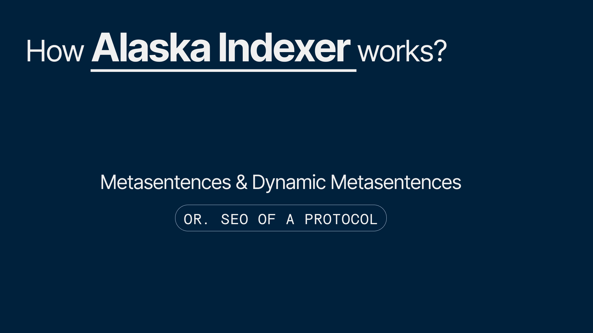
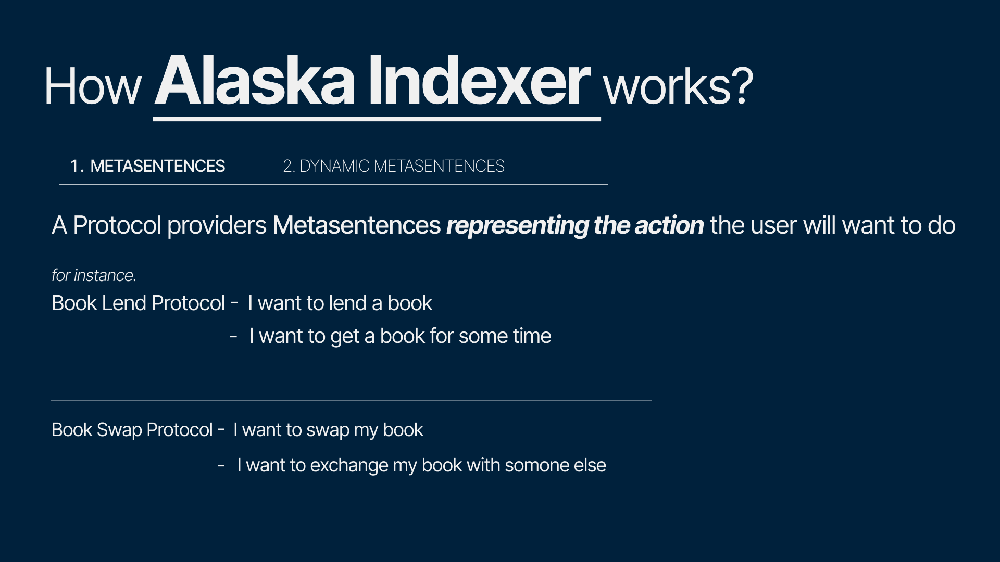
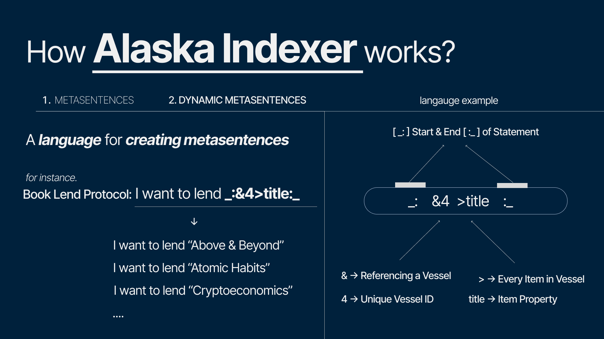
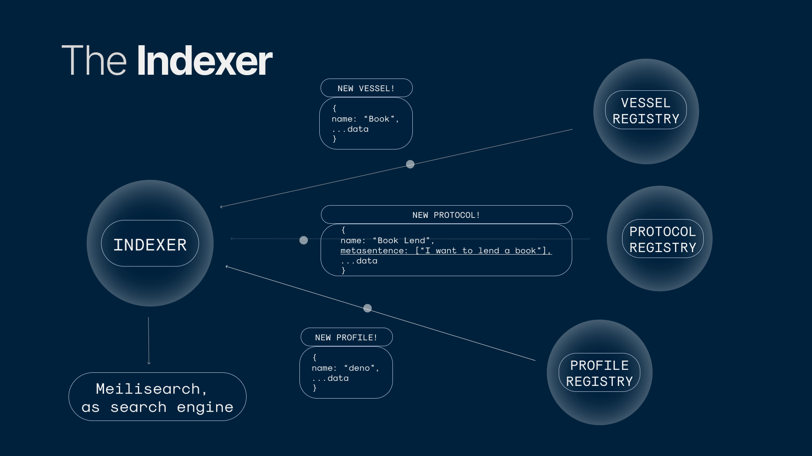

import Bleed from 'nextra-theme-docs/bleed'
import Callout from 'nextra-theme-docs/callout'

## Alaska Indexer

The technology behind working of Alaska Indexer is what I call `Metasentences` & `Dynamic Metasentences`

<Bleed></Bleed>
<Bleed></Bleed>
<Bleed></Bleed>
<Bleed></Bleed>
