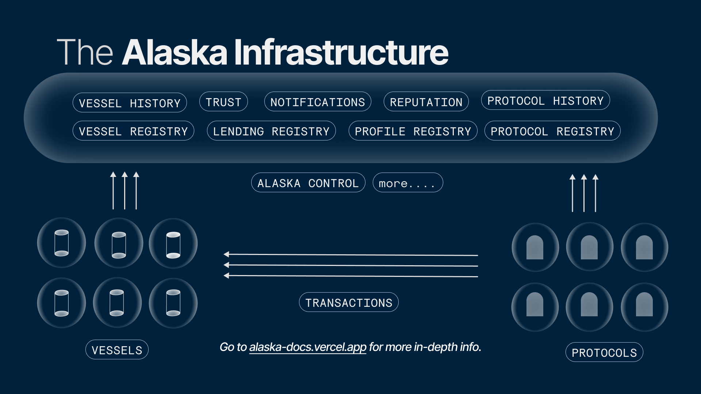
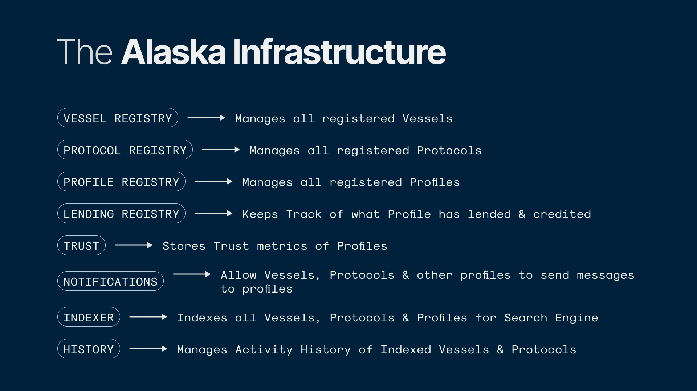
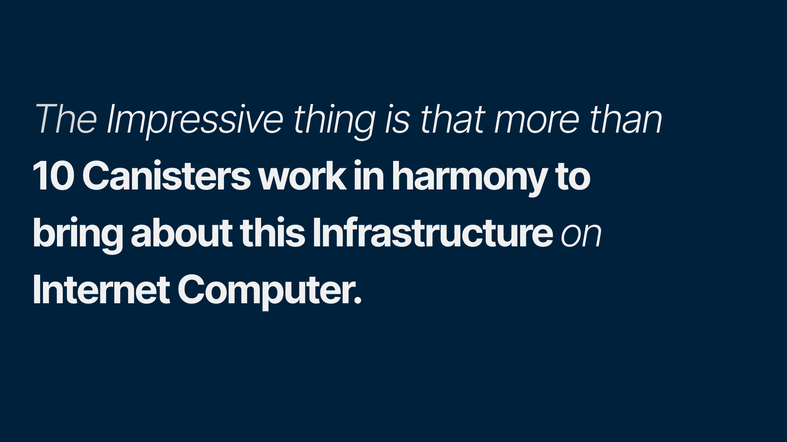

import Bleed from 'nextra-theme-docs/bleed'

## Alaska Architecture

Motoko gives a unique feature where you can talk to another Canisters with their Principal ID, this feature is being used in almost all the Canisters and it was impossible to build this project without this single feature. :)

<Bleed></Bleed>
<Bleed></Bleed>
<Bleed></Bleed>
